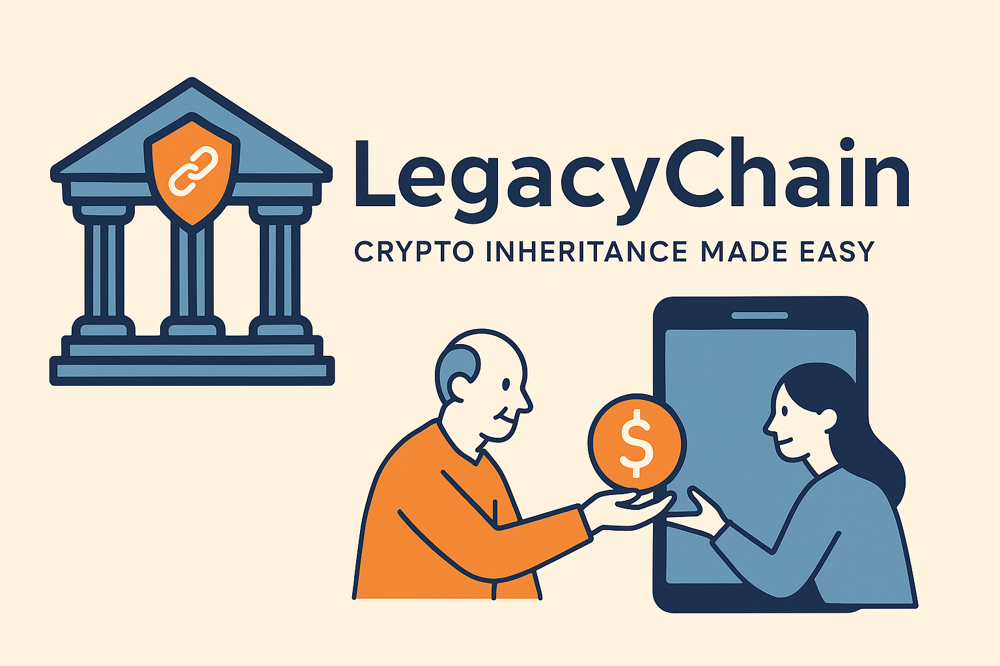

# 🏛️ LegacyChain – Transmission sécurisée d’actifs numériques via Smart Contract

> **"La première plateforme open source dédiée à la succession crypto, transparente, résiliente et notariale."**

---

## 🧭 Vision

Dans un monde où les actifs numériques se démocratisent, leur transmission en cas de décès reste un défi. **LegacyChain** est une solution décentralisée, sécurisée et transparente qui permet à chacun de préparer sa succession crypto en toute sérénité, en intégrant notaire, héritiers et smart contracts.

---

## 🧱 Le projet en briques (Roadmap itérative)

| Étape                                      | Description                                         | Statut     |
| ------------------------------------------ | --------------------------------------------------- | ---------- |
| 1. Authentification avec wallet (MetaMask) | Connexion de l’utilisateur à la plateforme          | ⏳ À faire |
| 2. Visualisation des actifs                | Affichage en temps réel des avoirs du wallet        | ⏳ À faire |
| 3. Création du testament numérique         | Interface de répartition des actifs entre héritiers | ⏳ À faire |
| 4. Rôle du notaire                         | Vérification et validation légale du testament      | ⏳ À faire |
| 5. Exécution du smart contract             | Déclenchement du transfert après décès              | ⏳ À faire |
| 6. Stockage seed phrase sécurisé           | Encryption + stockage décentralisé                  | ⏳ À faire |
| 7. Transparence pour héritiers             | Accès à l’historique et aux allocations             | ⏳ À faire |
| 8. Assistant IA intégré                    | Aide intelligente à chaque étape                    | ⏳ À faire |

✅ Fait | 🔄 En cours | ⏳ À faire
---

## 🛠️ Stack technique

* **Backend :** Ruby on Rails 7, PostgreSQL, Sidekiq
* **Frontend :** Hotwire, StimulusJS
* **Smart contracts :** Solidity (EVM)
* **Blockchain :** Ethereum, IPFS/Arweave
* **Sécurité :** Authentification via wallet, cryptographie asymétrique
* **IA :** Intégration OpenAI (assistant intelligent)
* **CI/CD :** GitHub Actions, Docker

---

## 💡 Fonctionnalités principales

* Création et validation de testament numérique (multi-héritiers)
* Intégration du notaire (via wallet)
* Exécution automatique via smart contract au décès
* Gestion des cas particuliers : héritier ayant perdu son wallet, solde non divisible, refus notarial, etc.
* Stockage sécurisé et distribué de la seed phrase
* Assistance utilisateur via OpenAI (aide pédagogique et technique)
* Transparence post-mortem garantie

---

## 🚀 Pourquoi ce projet est unique

### 🔍 Concurrence & Positionnement

> À ce jour, aucune solution sur le marché ne propose une gestion complète, décentralisée et vérifiable de la succession d’actifs numériques en intégrant :
>
> * l’ensemble des acteurs (testateur, notaire, héritiers)
> * la conversion automatique des actifs en stablecoins
> * une exécution notariale contrôlée
> * une transparence absolue entre les parties
> * une aide intelligente et pédagogique basée sur l’IA

---

## 🧑‍💻 Contribuer au projet

Nous accueillons avec joie les contributions :

* 📦 développeurs Rails ou Solidity
* 🎨 designers UX pour améliorer les interfaces
* 📚 rédacteurs pour documenter
* 👮 juristes pour améliorer la partie légale
* 🌐 traducteurs pour l’internationalisation

### Pour contribuer :

```bash
git clone https://github.com/ton-utilisateur/legacychain.git
cd legacychain
bin/setup
```


---

## 📜 Licence

Ce projet est sous licence MIT. Utilisez-le, améliorez-le, construisez avec nous l’héritage numérique de demain.

---

